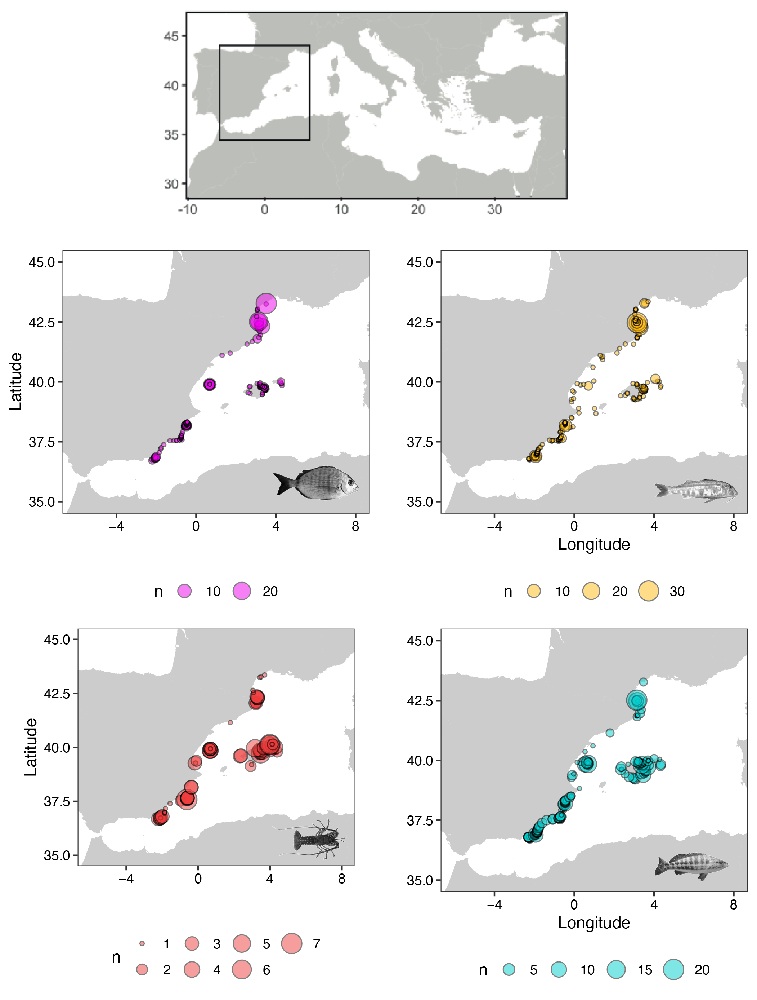
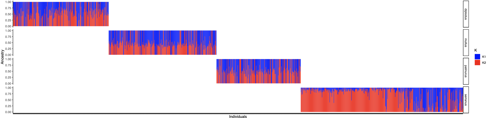

# finescale_ibd
Code for the paper "Restricted dispersal in a sea of gene flow"

# Table of contents

0. [Introduction](#0-introduction)
1. [Sampling](#1-installation)
2. [Population structure](#2-ibd)
3. [IBD](#3-ibd)
4. [Finescale IBD](#4-finescale_ibd)

# 0. Introduction

This github page is to explain step-by-step the statistical analyses presented in the paper entitled "Restricted dispersal in a sea of gene flow".
This paper is part of the project [Reservebenfit](https://www.biodiversa.org/1023) that aims to evaluate and manage connectivity in a network of Marine Protected Areas to maintain genetic diversity and deliver fish beyond protected limits.

# 1. Sampling

Sampling scheme is individual-based, as opposed to the population-level analyses that are typically conducted at large spatial scales.
We adopt this individual‐based sampling scheme to efficiency detect isolation‐by‐distance as indicated by a [*in silico* analysis](https://onlinelibrary.wiley.com/doi/full/10.1111/mec.12499).

# 2. Population structure

We investigate population structure using the admixed model of [ADMIXTURE](https://pubmed.ncbi.nlm.nih.gov/19648217/) that uses maximum likelihood.
To compile the results we use the script `script-admixture.R` on our 4 species.
We show that only *Serranus cabrilla* shows evidence of north/south population structure (samples are ordered by latitude).

</img>

# 3. Isolation-by-distance at large scale

## Calculating In-water distances

We first test Isolation by distance patterns using a classic Mantel test.
To compute in-water geographic distances, we use `marmap`package available in R.

## Choosing the most accurate relatedness coefficient

We calculate two different relatedness coefficients: 
1. [Loiselle et al (1995)](https://bsapubs.onlinelibrary.wiley.com/doi/abs/10.1002/j.1537-2197.1995.tb12679.x)
2. [Yang et al. (2010)](https://www.ncbi.nlm.nih.gov/pmc/articles/PMC3232052/)

The Loiselle coefficient calculate the relative probability of identity by descent of the alleles within the two compared individuals. 
This index uses the allele frequencies within the whole dataset, making the distances between pairs of individuals dependent on all other individuals in the dataset.
Loiselle coefficient is available in both [GENODIVE](https://www.bentleydrummer.nl/software/software/GenoDive.html) and [GENEPOP](https://kimura.univ-montp2.fr/~rousset/Genepop4.7.pdf) 
(Note that this coefficient is also named ê Rousset).
Loiselle coefficient is the only estimator that uses a correction for small sample sizes.
A [recent study](https://www.nature.com/articles/hdy201752) demonstrates that this coefficient is robust to different sample sizes.

The relatedness coefficient of [Yang et al](https://www.nature.com/articles/ng.608) is calculated with the `--relatedness` function available in [VCFTOOLS](http://vcftools.sourceforge.net). 
This coefficient is particularly appropriate for large cohorts. 

## Classic Mantel test

We test the significance of the relationship between in-water distances and relatedness index with the `ecodist` package.
Mantel’s r, one-tailed p-values (null-hypothesis r ≤ 0) is estimated with 10,000 permutations.
Overall, we find no evidence of isolation by distance across the four studied species (see below).

#### Number of restriction sites estimation

| Species | Mantel r | P-value |
|--------|--------------------------------------------------|-------------|
| D. sargus | -0,016 | 0,999 | 
| M. surmuletus | -0,042 | 1 |
| P. elephas | -0,376 | 1 |
| S. cabrilla | -0,010 | 0,968 |

# 4. Fine-scale isolation-by-distance

Without evidence of IBD on a large scale, we decide to observe this pattern on a finer scale, i.e. every 5km.
To do so, we implemeted a function called `Function_slope_SES`in R to perform the calculation of Standardised effect sizes (SES) values on the slope of the relationship between relatedness and in-water distance.
SES are calculated for each spatial interval using the observed slope values and the mean and standard deviation of the null distributions: SES = (observed – mean(null))/SD(null). 
SES values serve as a measure of departure from a pure null expectation. 

Departures from 0 indicate non-randomness: values greater than 1.96 or smaller than 1.96 mean that the is slope significantly greater or lower than expected at the α = 0.05 level.

